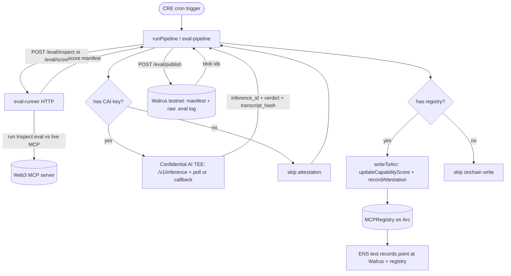
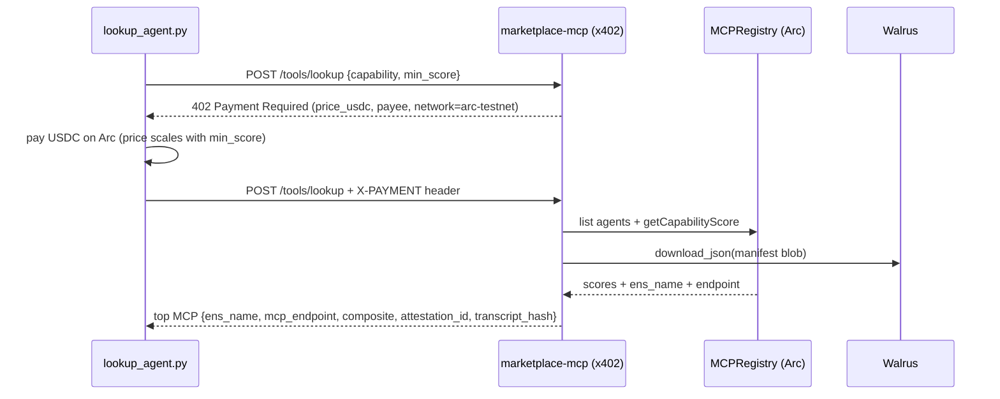

# GoldenMCP

Web3 MCP evaluation marketplace: standardized Inspect evals, Walrus-backed results, ENS identity, Chainlink attestation, and x402 discovery on Arc.

Evals run against live Web3 MCP servers, get scored on data accuracy / tool-path / token efficiency, and the results are published to Walrus, attested by Chainlink Confidential AI, and written onchain to an MCP registry on Arc. Agents then pay a small USDC micropayment (x402) to look up the best-scoring MCP for a capability.

## Bounties — find your code

Each bounty's integration lives in a small number of files. Links go straight to the relevant source on `main`.

### ENS — MCP discovery via ENSIP-25/26

ENS names are the public identity for each scored MCP; text records point at Walrus eval blobs and the onchain registry, resolved live (no hard-coded names).

| What | Code |
|------|------|
| ENS text-record resolver (`resolve_text`, `resolve_agent_context`, `resolve_eval_blob`, `resolve_mcp_endpoint`) | [`packages/identity/src/goldenmcp_identity/registry.py`](https://github.com/vhspace/goldenmcp/blob/main/packages/identity/src/goldenmcp_identity/registry.py) |
| Registry SDK (`ens_name` field, register/lookup) | [`packages/identity/`](https://github.com/vhspace/goldenmcp/tree/main/packages/identity) |
| Live ENS resolver UI | [`apps/web/src/app/ens/page.tsx`](https://github.com/vhspace/goldenmcp/blob/main/apps/web/src/app/ens/page.tsx) |

### Chainlink — CRE eval orchestration + Confidential AI attestation

A Chainlink CRE workflow orchestrates the whole pipeline: it calls the eval-runner to score an MCP, submits the score manifest to Confidential AI (CAI) for attestation, publishes to Walrus, then writes the score + attestation onchain.

The attestation **is** the completed TEE inference — there is no synthetic tx hash. The pipeline records the CAI `inference_id` and the `bytes32` **transcript hash** (the enclave's `response_digest`, falling back to `sha256(output)`) on-chain via `recordAttestation`, mirroring Chainlink's official undercollateralized-loan example.

| What | Code |
|------|------|
| CRE pipeline (eval → CAI attest → Walrus → Arc) | [`workflows/eval-pipeline/src/pipeline.ts`](https://github.com/vhspace/goldenmcp/blob/main/workflows/eval-pipeline/src/pipeline.ts) |
| CRE workflow entrypoint + cron trigger | [`workflows/eval-pipeline/src/workflow.ts`](https://github.com/vhspace/goldenmcp/blob/main/workflows/eval-pipeline/src/workflow.ts) |
| CAI submit/poll + attestation parsing (`caiAttest`, `parseCaiAttestation`) | [`workflows/eval-pipeline/src/pipeline.ts`](https://github.com/vhspace/goldenmcp/blob/main/workflows/eval-pipeline/src/pipeline.ts) |
| eval-runner HTTP service CRE calls | [`packages/eval-runner/`](https://github.com/vhspace/goldenmcp/tree/main/packages/eval-runner) |
| CRE workflow config | [`workflows/eval-pipeline/workflow.yaml`](https://github.com/vhspace/goldenmcp/blob/main/workflows/eval-pipeline/workflow.yaml) |

### Arc — x402 USDC nanopayments for MCP lookup

The marketplace MCP is x402-gated: lookups return HTTP 402 with a USDC price until a payment header is present. Scores are written to an ERC-8004-inspired registry deployed on Arc, where USDC is the native gas token.

| What | Code |
|------|------|
| x402-gated lookup server (402 challenge, price ladder, settlement) | [`packages/marketplace-mcp/src/goldenmcp_marketplace/app.py`](https://github.com/vhspace/goldenmcp/blob/main/packages/marketplace-mcp/src/goldenmcp_marketplace/app.py) |
| MCP registry contract (`register`, `updateCapabilityScore`, `recordAttestation`) | [`contracts/mcp-registry/src/MCPRegistry.sol`](https://github.com/vhspace/goldenmcp/blob/main/contracts/mcp-registry/src/MCPRegistry.sol) |
| Arc deploy script | [`contracts/mcp-registry/script/Deploy.s.sol`](https://github.com/vhspace/goldenmcp/blob/main/contracts/mcp-registry/script/Deploy.s.sol) |
| x402 lookup agent demo | [`demo/lookup_agent.py`](https://github.com/vhspace/goldenmcp/blob/main/demo/lookup_agent.py) |
| CRE → Arc registry write (`writeToArc`) | [`workflows/eval-pipeline/src/pipeline.ts`](https://github.com/vhspace/goldenmcp/blob/main/workflows/eval-pipeline/src/pipeline.ts) |

## Workflow diagrams

### Eval pipeline (Chainlink CRE)

A CRE cron trigger drives each MCP/capability through scoring, attestation, storage, and the onchain write. CAI and Arc steps degrade gracefully (skipped) when their credentials are absent, so the pipeline is simulatable without secrets.



### x402 lookup + payment (Arc)

An agent asks the marketplace for the best MCP for a capability. The first call returns a 402 with a USDC price; the agent pays in USDC on Arc and retries with a payment header to receive the top-scoring endpoint.



## Setup

### Prerequisites

- Python 3.12, managed with [`uv`](https://docs.astral.sh/uv/) (no `pip`)
- [`bun`](https://bun.sh/) for the web app and CRE TypeScript workflow
- [`foundry`](https://book.getfoundry.sh/) (`forge`, `cast`) for contracts and wallet generation
- An LLM API key (e.g. Anthropic) and reachable Web3 MCP endpoints

### Install

```bash
# Python toolchain + workspace
uv python install 3.12
uv sync --all-packages

# Credentials — copy and fill in
cp .env.example .env
```

Or bootstrap a demo machine (generates a `cast` wallet, sets MCP URLs, runs `uv sync`):

```bash
chmod +x scripts/setup_eval_env.sh
./scripts/setup_eval_env.sh          # full bootstrap
./scripts/setup_eval_env.sh --check  # prerequisites only
```

Eval chain defaults: **Base (8453)** for quote evals; **Fraxtal (252)** for `odos_swap`. Fund `EVM_EVAL_ADDRESS` on Base (and Fraxtal for Odos swaps). ENS identity uses **Sepolia** separately.

### Run

```bash
# Unit tests
uv run pytest packages/ -v

# Run an eval against a live MCP (needs LLM key + MCP endpoints in .env)
uv run inspect eval goldenmcp/lifi_quote --model anthropic/claude-3-5-haiku-20241022
uv run inspect eval goldenmcp/odos_quote --model anthropic/claude-3-5-haiku-20241022

# eval-runner HTTP service (the API the CRE workflow calls)
uv run python -m goldenmcp_eval_runner

# Marketplace MCP (x402-gated lookup)
uv run python -m goldenmcp_marketplace

# x402 lookup agent demo (needs Arc wallet + x402)
uv run python demo/lookup_agent.py --capability quote --min-score 0.9

# Web demo (leaderboard, eval viewer, ENS resolver)
cd apps/web && bun install && bun run dev
```

### Walrus + Inspect View

GoldenMCP stores eval logs on Walrus with an indexed `walrus://` path (S3-style keys over content-addressed blobs). After the first upload, set `WALRUS_INDEX_BLOB_ID` in `.env` from the `walrus_index_blob_id` field printed by `post_eval_walrus.py`.

```bash
# Upload scored eval + raw Inspect log bytes
uv run python scripts/post_eval_walrus.py --mcp lifi --capability quote --log ./logs/your-run.json

# List logs from Walrus (same as s3:// log-dir)
uv run inspect view start --log-dir walrus://evals/goldenmcp
```

Inspect View requires native `.eval` / JSON log files at indexed paths — not score-manifest JSON alone.

## Scoring

| Dimension | Weight |
|-----------|--------|
| DataScore | 0.45 |
| PathScore | 0.35 |
| TokenEfficiency | 0.20 |

Binary fail (composite 0.0) on prompt injection, disallowed tools, or policy violations.

See [docs/scoring.md](docs/scoring.md).

## Agent skills (Chainlink)

Project-local [Chainlink Developer Agent Skills](https://docs.chain.link/resources/chainlink-developer-agent-skills) from `smartcontractkit/chainlink-agent-skills`:

| Path | Agent |
|------|-------|
| `.agents/skills/` | Cursor |
| `.claude/skills/` | Claude Code (this repo) |

Installed skills: CRE, Confidential AI Attester, CCIP, Data Feeds, Data Streams, ACE, VRF. Pin file: `skills-lock.json`.

Invoke explicitly in chat, e.g. `Using /chainlink-cre-skill, …` or `/chainlink-confidential-ai-attester-skill` for CAI attestation work.

Refresh from upstream:

```bash
npx skills add smartcontractkit/chainlink-agent-skills --skill '*' --agent cursor --agent claude-code -y --copy
```

## Structure

```
packages/inspect-web3     Inspect tasks + scorers
packages/walrus-client    walrus:// fsspec + HTTP client
packages/marketplace-mcp  x402 MCP server
packages/identity         ENS + registry SDK
packages/eval-runner      HTTP service for CRE
apps/web                  Leaderboard, eval viewer, ENS resolver
workflows/eval-pipeline   Chainlink CRE workflow
contracts/mcp-registry    ERC-8004-inspired MCP registry (Arc)
```

Architecture overview: [docs/architecture.md](docs/architecture.md). All implementation plans: [docs/plans/](docs/plans/).

## License

MIT
