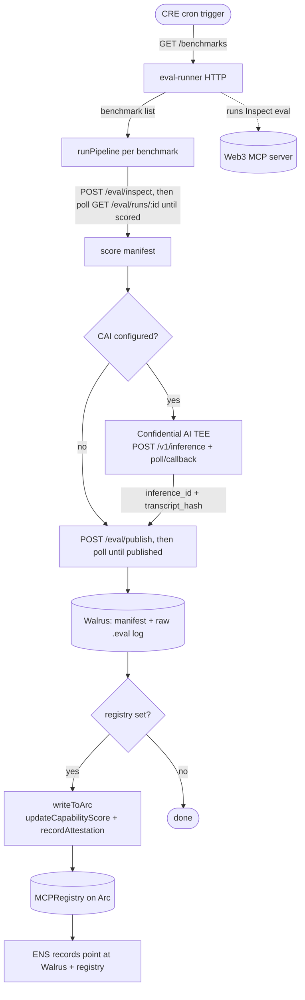
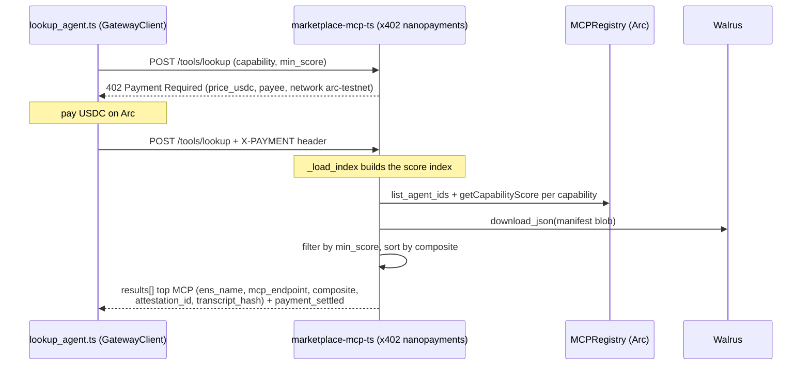

# GoldenMCP

> An onchain reputation layer for Web3 MCP servers. Evals score live MCPs on data accuracy / tool-path / token efficiency; results are attested by Chainlink Confidential AI, stored on Walrus, written to a registry on Arc, and made discoverable via ENS — queryable by agents for a USDC nanopayment.

**Live demo:** https://goldenmcp-e9l6.vercel.app/demo · **Demo video:** _(coming soon)_ · **Registry on Arc:** [`0x8db0…20e3`](https://testnet.arcscan.app/address/0x8db02877046c8fA3c8c6Abb2565094Ca29E820e3)

## Bounties — find your code

We're targeting: **Chainlink** (Best workflow with CRE + Best usage of Confidential AI Attester) · **Arc** (Best Agentic Economy with Circle Agent Stack) · **ENS** (Best Integration for AI Agents). **Walrus** is a supporting integration, not a bounty submission.

Each bounty's integration lives in a small number of files. Links go straight to the relevant source on `main`.

### ENS — MCP discovery via ENSIP-25/26

**Submitting for:** Best ENS Integration for AI Agents.

ENS is the identity and discovery layer for every scored MCP. Each MCP is a `child.parent.eth` subname under [`goldenmcp.eth`](https://sepolia.app.ens.domains/goldenmcp.eth) (Sepolia), and its **agent context, MCP endpoint, and Walrus eval-blob pointer are stored as text records** (`agent-context`, `agent-endpoint[mcp]`, `goldenmcp/eval-blob`, per ENSIP-25/26). We read each subname's **ENSv2 TTL expiry** (walking `.eth registry → getSubregistry → findExpiry`) and mark an MCP **stale** once its identity has lapsed — so a name with an expired registration is visibly out of date rather than silently trusted. Discovery is fully live: no hard-coded names or values.

**On-chain (Sepolia):** ENSv2 `.eth` registry [`0xDEDB92913A25abE1f7BCDD85D8A344a43B398B67`](https://sepolia.etherscan.io/address/0xDEDB92913A25abE1f7BCDD85D8A344a43B398B67).

| What | Code |
|------|------|
| ENS text-record resolver (`resolve_text`, `resolve_agent_context`, `resolve_eval_blob`, `resolve_mcp_endpoint`) | [`packages/identity/src/goldenmcp_identity/registry.py`](https://github.com/vhspace/goldenmcp/blob/main/packages/identity/src/goldenmcp_identity/registry.py) |
| ENSv2 TTL expiry / staleness check (`resolveENS`, `ensSubnameExpiry`) | [`apps/web/src/lib/data.ts`](https://github.com/vhspace/goldenmcp/blob/main/apps/web/src/lib/data.ts) |
| Registry SDK (`ens_name` field, register/lookup) | [`packages/identity/`](https://github.com/vhspace/goldenmcp/tree/main/packages/identity) |
| Live ENS resolver UI | [`apps/web/src/app/ens/page.tsx`](https://github.com/vhspace/goldenmcp/blob/main/apps/web/src/app/ens/page.tsx) |

### Chainlink — CRE eval orchestration + Confidential AI attestation

**Submitting for:** Best workflow with CRE + Best usage of Confidential AI Attester.

A Chainlink CRE workflow orchestrates the whole pipeline: it calls the eval-runner to score an MCP, submits the score manifest to Confidential AI (CAI) for attestation, publishes to Walrus, then **writes the score + attestation onchain** via `updateCapabilityScore` + `recordAttestation` on the Arc registry. The CRE workflow drives a real onchain state change — it is the orchestration layer, not a frontend read.

The attestation **is** the completed TEE inference — there is no synthetic tx hash. CAI processes the eval manifest (sensitive scoring data) inside the enclave; the pipeline records the CAI `inference_id` and the `bytes32` **transcript hash** (the enclave's `response_digest`, falling back to `sha256(output)`) onchain via `recordAttestation`, mirroring Chainlink's official undercollateralized-loan example.

The CRE workflow's onchain target is the same Arc registry — [`recordAttestation` + `updateCapabilityScore` on `0x8db0…20e3`](https://testnet.arcscan.app/address/0x8db02877046c8fA3c8c6Abb2565094Ca29E820e3).

| What | Code |
|------|------|
| CRE pipeline (eval → CAI attest → Walrus → Arc) | [`workflows/eval-pipeline/src/pipeline.ts`](https://github.com/vhspace/goldenmcp/blob/main/workflows/eval-pipeline/src/pipeline.ts) |
| CRE workflow entrypoint + cron trigger | [`workflows/eval-pipeline/src/workflow.ts`](https://github.com/vhspace/goldenmcp/blob/main/workflows/eval-pipeline/src/workflow.ts) |
| CAI submit/poll + attestation parsing (`caiAttest`, `parseCaiAttestation`) | [`workflows/eval-pipeline/src/pipeline.ts`](https://github.com/vhspace/goldenmcp/blob/main/workflows/eval-pipeline/src/pipeline.ts) |
| eval-runner HTTP service CRE calls | [`packages/eval-runner/`](https://github.com/vhspace/goldenmcp/tree/main/packages/eval-runner) |
| CRE workflow config | [`workflows/eval-pipeline/workflow.yaml`](https://github.com/vhspace/goldenmcp/blob/main/workflows/eval-pipeline/workflow.yaml) |

### Arc — x402 USDC nanopayments for MCP lookup

**Submitting for:** Best Agentic Economy with Circle Agent Stack. GoldenMCP is a pay-per-query agent marketplace — agents pay gas-free USDC nanopayments on Arc to look up the best-scoring MCP for a capability, with no human in the loop.

The marketplace MCP is x402-gated: lookups return HTTP 402 with a USDC price until a payment header is present. Scores are written to an ERC-8004-inspired registry deployed on Arc, where USDC is the native gas token.

**On-chain (Arc testnet, chain `5042002`):**

| Contract | Address |
|----------|---------|
| MCPRegistry | [`0x8db02877046c8fA3c8c6Abb2565094Ca29E820e3`](https://testnet.arcscan.app/address/0x8db02877046c8fA3c8c6Abb2565094Ca29E820e3) |
| USDC (gas token) | [`0x3600000000000000000000000000000000000000`](https://testnet.arcscan.app/address/0x3600000000000000000000000000000000000000) |
| x402 payee | [`0x1A067578b8d4f69eFB1B8b857c99d1b825E84e73`](https://testnet.arcscan.app/address/0x1A067578b8d4f69eFB1B8b857c99d1b825E84e73) |

| What | Code |
|------|------|
| x402-gated lookup server (402 challenge, price ladder, settlement) | [`packages/marketplace-mcp/src/goldenmcp_marketplace/app.py`](https://github.com/vhspace/goldenmcp/blob/main/packages/marketplace-mcp/src/goldenmcp_marketplace/app.py) |
| MCP registry contract (`register`, `updateCapabilityScore`, `recordAttestation`) | [`contracts/mcp-registry/src/MCPRegistry.sol`](https://github.com/vhspace/goldenmcp/blob/main/contracts/mcp-registry/src/MCPRegistry.sol) |
| Arc deploy script | [`contracts/mcp-registry/script/Deploy.s.sol`](https://github.com/vhspace/goldenmcp/blob/main/contracts/mcp-registry/script/Deploy.s.sol) |
| x402 nanopayments seller + buyer (Circle Gateway, Arc) | [`packages/marketplace-mcp-ts/`](https://github.com/vhspace/goldenmcp/blob/main/packages/marketplace-mcp-ts/) |
| CRE → Arc registry write (`writeToArc`) | [`workflows/eval-pipeline/src/pipeline.ts`](https://github.com/vhspace/goldenmcp/blob/main/workflows/eval-pipeline/src/pipeline.ts) |

### Walrus — decentralized eval-blob storage (supporting integration)

Eval results need durable, verifiable, content-addressed storage that any agent can read without trusting our server — so the eval store is **Walrus**, the Sui-native decentralized blob store. Every score manifest and raw Inspect `.eval` log is written to Walrus testnet via its publisher/aggregator HTTP API, and the resulting `walrus://<blobId>` is what ENS text records and the Arc registry point at. Walrus does genuine work in the stack: it's the storage layer the onchain reputation and the demo viewer both resolve against.

| What | Code |
|------|------|
| Walrus publisher/aggregator client (`upload`, `download`, `*_json`) | [`packages/walrus-client/src/goldenmcp_walrus/client.py`](https://github.com/vhspace/goldenmcp/blob/main/packages/walrus-client/src/goldenmcp_walrus/client.py) |
| `walrus://` fsspec adapter + index (Inspect View log dir) | [`packages/walrus-client/`](https://github.com/vhspace/goldenmcp/tree/main/packages/walrus-client) |
| Web demo Walrus manifest fetch | [`apps/web/src/lib/data.ts`](https://github.com/vhspace/goldenmcp/blob/main/apps/web/src/lib/data.ts) |

## Workflow diagrams

### Eval pipeline (Chainlink CRE)

A CRE cron trigger fetches the benchmark list, then runs each MCP/capability through scoring, attestation, storage, and the onchain write. The eval-runner calls are async: the pipeline kicks off a run and polls until it reaches `scored` / `published`. CAI and Arc steps are skipped when their credentials are absent, so the pipeline is simulatable without secrets.



### x402 lookup + payment (Arc)

An agent asks the marketplace for the best MCP for a capability. The first call returns a 402 with a USDC price (it scales with `min_score`); the agent pays in USDC on Arc and retries with an `X-PAYMENT` header. The marketplace then builds a score index from the registry + Walrus and returns the top match.



## Setup

### Prerequisites

- Python 3.12, managed with [`uv`](https://docs.astral.sh/uv/) (no `pip`)
- [`bun`](https://bun.sh/) for the web app and CRE TypeScript workflow
- [`foundry`](https://book.getfoundry.sh/) (`forge`, `cast`) for contracts and wallet generation
- An LLM API key (e.g. Anthropic) and reachable Web3 MCP endpoints

### Install

```bash
# Python toolchain + workspace
uv python install 3.12
uv sync --all-packages

# Credentials — copy and fill in
cp .env.example .env
```

Or bootstrap a demo machine (generates a `cast` wallet, sets MCP URLs, runs `uv sync`):

```bash
chmod +x scripts/setup_eval_env.sh
./scripts/setup_eval_env.sh          # full bootstrap
./scripts/setup_eval_env.sh --check  # prerequisites only
```

Eval chain defaults: **Base (8453)** for quote evals; **Fraxtal (252)** for `odos_swap`. Fund `EVM_EVAL_ADDRESS` on Base (and Fraxtal for Odos swaps). ENS identity uses **Sepolia** separately.

### Run

```bash
# Unit tests
uv run pytest packages/ -v

# Run an eval against a live MCP (needs LLM key + MCP endpoints in .env)
uv run inspect eval goldenmcp/lifi_quote --model anthropic/claude-3-5-haiku-20241022
uv run inspect eval goldenmcp/odos_quote --model anthropic/claude-3-5-haiku-20241022

# eval-runner HTTP service (the API the CRE workflow calls)
uv run python -m goldenmcp_eval_runner

# Marketplace seller (x402 nanopayments via Circle Gateway, Arc testnet)
(cd packages/marketplace-mcp-ts && bun install && bun src/server.ts)

# x402 buyer agent demo (EOA funded with Arc testnet USDC + native gas)
cd packages/marketplace-mcp-ts && DEMO_PAYER_PRIVATE_KEY=0x... bun demo/lookup_agent.ts --capability quote --min-score 0.9

# Web demo (leaderboard, eval viewer, ENS resolver)
cd apps/web && bun install && bun run dev
```

### Walrus + Inspect View

GoldenMCP stores eval logs on Walrus with an indexed `walrus://` path (S3-style keys over content-addressed blobs). After the first upload, set `WALRUS_INDEX_BLOB_ID` in `.env` from the `walrus_index_blob_id` field printed by `post_eval_walrus.py`.

```bash
# Upload scored eval + raw Inspect log bytes
uv run python scripts/post_eval_walrus.py --mcp lifi --capability quote --log ./logs/your-run.json

# List logs from Walrus (same as s3:// log-dir)
uv run inspect view start --log-dir walrus://evals/goldenmcp
```

Inspect View requires native `.eval` / JSON log files at indexed paths — not score-manifest JSON alone.

## Scoring

| Dimension | Weight |
|-----------|--------|
| DataScore | 0.45 |
| PathScore | 0.35 |
| TokenEfficiency | 0.20 |

Binary fail (composite 0.0) on prompt injection, disallowed tools, or policy violations.

See [docs/scoring.md](docs/scoring.md).

## Structure

```
packages/inspect-web3     Inspect tasks + scorers
packages/walrus-client    walrus:// fsspec + HTTP client
packages/marketplace-mcp  x402 MCP server
packages/identity         ENS + registry SDK
packages/eval-runner      HTTP service for CRE
apps/web                  Leaderboard, eval viewer, ENS resolver
workflows/eval-pipeline   Chainlink CRE workflow
contracts/mcp-registry    ERC-8004-inspired MCP registry (Arc)
```

Architecture overview: [docs/architecture.md](docs/architecture.md). All implementation plans: [docs/plans/](docs/plans/).

## Deploy demo UI to Vercel (GH #106)

The hackathon judge demo (`apps/web`) deploys to [Vercel](https://vercel.com) with **Root Directory** `apps/web`. Eval-runner and marketplace stay on existing infra; set their public URLs in Vercel env vars.

Full checklist and variable list: [docs/plans/2026-06-13-vercel-deploy.md](docs/plans/2026-06-13-vercel-deploy.md).

```bash
# Local smoke (from apps/web)
bun install && bun test && bun run build
```

## License

MIT
