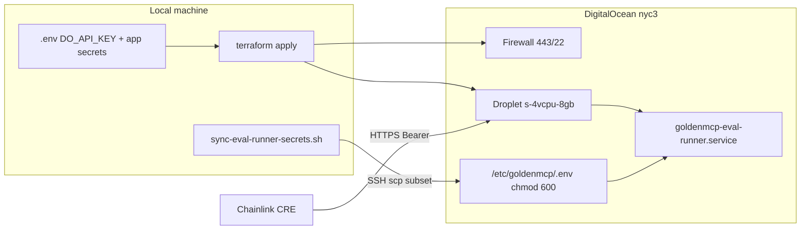

# GH #59: DO eval-runner Terraform plan

## Context

- **Issue:** [GH #59](https://github.com/vhspace/goldenmcp/issues/59) — deploy eval-runner so CRE can call `https://eval.<host>/…`
- **Branch/worktree:** `feat/do-eval-runner` under `.worktrees/feat/do-eval-runner` (per [git-worktree-workflow.mdc](.cursor/rules/git-worktree-workflow.mdc))
- **DO auth:** `DO_API_KEY` in local [`.env`](.env) (never committed); Terraform provider reads `DIGITALOCEAN_TOKEN` exported by apply script
- **Terraform:** pin `required_version = ">= 1.14.0"`; recommend upgrading local CLI to **1.15.6** (current install is 1.14.5). Provider: `digitalocean/digitalocean` **2.89.0** (latest per registry)
- **Region:** **nyc3** (user confirmed)

## Architecture



---

## Secrets strategy (DO has no Droplet secrets vault)

DigitalOcean **does not** offer AWS-style Secrets Manager for raw Droplets. Options:

| Approach | Use for GoldenMCP |
|----------|-------------------|
| **App Platform encrypted env vars** | Only if we ran on App Platform — **not suitable** (Inspect needs subprocess + stdio MCP + long jobs) |
| **OAuth workload identity (OIDC PoC)** | Future; too heavy for hackathon |
| **Secrets in Terraform state / cloud-init** | **Avoid** — LLM keys and `WALLET_PRIVATE_KEY` would land in `.tfstate` |
| **Post-provision SSH sync (recommended)** | Terraform creates droplet + hardening; [`scripts/sync-eval-runner-secrets.sh`](scripts/sync-eval-runner-secrets.sh) copies a **filtered** `.env` over SSH to `/etc/goldenmcp/.env` |
| **gitignored `secrets.auto.tfvars`** | Optional for non-app secrets (SSH key name, allowed_ips); **not** for LLM/wallet keys |

**On droplet:** `/etc/goldenmcp/.env` owned by `goldenmcp:goldenmcp`, mode `600`. systemd `EnvironmentFile=` loads it. Generate `EVAL_RUNNER_API_KEY` on first sync if missing.

**Terraform-only secret:** `DO_API_KEY` stays on the operator laptop for `terraform apply` only.

---

## Terraform layout (new)

Create [`infra/terraform/eval-runner/`](infra/terraform/eval-runner/):

| File | Purpose |
|------|---------|
| `versions.tf` | Terraform `>= 1.14.0`, provider `digitalocean/digitalocean` `~> 2.89` |
| `variables.tf` | `region` (default `nyc3`), `droplet_size` (default `s-4vcpu-8gb`), `ssh_key_fingerprint`, `allowed_ssh_cidrs`, `project_name`, `repo_url`, `repo_branch` |
| `main.tf` | SSH key data source (if fingerprint var), droplet, firewall, optional project assignment |
| `cloud-init.yaml.tftpl` | Bootstrap: Ubuntu 24.04 packages (`curl`, `git`, `node`, `nginx` or `caddy`), install `uv`, create `goldenmcp` user, clone repo, `uv sync`, systemd unit template **without secrets**, enable nginx reverse proxy `:443` → `:8090` (TLS via self-signed or certbot placeholder) |
| `outputs.tf` | `droplet_ip`, `droplet_id`, `health_check_url`, `ssh_command` |
| `terraform.tfvars.example` | Non-secret defaults |
| `README.md` | Apply/destroy/sync workflow |

**Droplet spec:** `s-4vcpu-8gb` (4 vCPU, **8 GB RAM**) — enough for Inspect + npx MCPs + concurrent HTTP.

**Firewall:**
- Inbound **22** from operator IP(s) only (`allowed_ssh_cidrs`)
- Inbound **443** from `0.0.0.0/0` (eval-runner behind bearer auth — GH #23)
- Deny direct **8090** from internet

**State:** local backend initially (`infra/terraform/eval-runner/terraform.tfstate` gitignored). Optional follow-up: DO Spaces backend (no secrets in state).

---

## Supporting scripts

1. **[`scripts/terraform-apply-eval-runner.sh`](scripts/terraform-apply-eval-runner.sh)**
   - `set -a; source .env; set +a`
   - `export DIGITALOCEAN_TOKEN="${DO_API_KEY}"`
   - `cd infra/terraform/eval-runner && terraform init && terraform plan/apply`
   - Fail if `DO_API_KEY` unset

2. **[`scripts/sync-eval-runner-secrets.sh`](scripts/sync-eval-runner-secrets.sh)**
   - Args: droplet IP (from terraform output)
   - Build temp env file from local `.env` with **allowlist** only: LLM keys, MCP URLs/keys, `WALLET_*`, `WALRUS_*`, `EVAL_RUNNER_*`, `CHAINLINK_CAI_*`, `KYBERSWAP_*`, `SOLANA_*`, `JUPITER_*`, `INFURA_KEY`
   - `scp` to `root@$IP:/etc/goldenmcp/.env`, `chown goldenmcp:goldenmcp`, `chmod 600`
   - `systemctl restart goldenmcp-eval-runner`

3. **Update [`.env.example`](.env.example)** — document `DO_API_KEY`, `EVAL_RUNNER_API_KEY`, `EVAL_RUNNER_PUBLIC_URL` (no values)

4. **[`docs/eval-runner-host.md`](docs/eval-runner-host.md)** — full runbook (issue #59 deliverable)

---

## systemd unit (cloud-init)

```ini
[Service]
User=goldenmcp
WorkingDirectory=/opt/goldenmcp
EnvironmentFile=/etc/goldenmcp/.env
ExecStart=/home/goldenmcp/.local/bin/uv run python -m goldenmcp_eval_runner
Restart=always
```

Health check after sync: `curl -sf https://$IP/health` (or HTTP until TLS configured).

---

## Apply (user-run, post-merge)

```bash
./scripts/terraform-apply-eval-runner.sh
terraform -chdir=infra/terraform/eval-runner output droplet_ip
./scripts/sync-eval-runner-secrets.sh $(terraform -chdir=infra/terraform/eval-runner output -raw droplet_ip)
```

Wire CRE `evalRunnerUrl` to droplet HTTPS URL in a follow-up change to [`workflows/eval-pipeline/workflow.yaml`](workflows/eval-pipeline/workflow.yaml) / `config.staging.json`.

---

## Out of scope (this PR)

- GH #23 pipeline split (`/eval/publish`, bearer auth middleware) — separate PR; document interim manual test
- Certbot / custom domain — use droplet IP or self-signed first; Caddy + Let's Encrypt as optional README section
- `doctl` install — optional; Terraform provider sufficient

---

## Verification

- `terraform validate` passes in CI (new job or document manual check)
- `terraform plan` succeeds with `DO_API_KEY` from env
- After apply + sync: `curl https://<ip>/health` returns 200
- No secrets in committed files; `secrets.auto.tfvars`, `*.tfstate`, `.terraform/` gitignored
