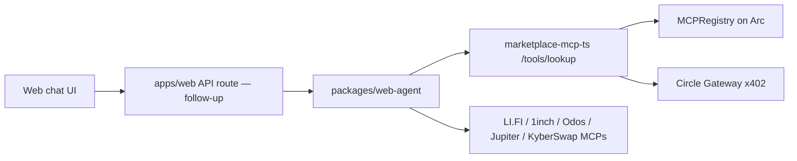

# Web concierge agent (2026-06-13)

## Goal

Server-side agent for the embedded Web3 chat on `apps/web`: Sonnet 4.6 concierge that
pre-wires all eval vendor MCPs plus the GoldenMCP marketplace with real x402 USDC pricing.

## Architecture



- **Vendor MCPs**: reuse `goldenmcp_inspect.mcp_connectors` launch configs.
- **Marketplace**: HTTP + x402 (`packages/marketplace-mcp-ts`); scores from `MCPRegistry`,
  price from `base_usdc * (1 + 4 * min_score)` (off-chain formula, same as `pricing.ts`).
- **Paid lookup**: `packages/web-agent/ts/marketplace_x402.ts` wraps `GatewayClient` from
  `lookup_agent.ts` (no Python mock settlement).

## Package layout

```
packages/web-agent/
  src/goldenmcp_web_agent/
    pricing.py          # price ladder
    mcp_manifest.py     # Cursor/Claude MCP JSON for all vendors + marketplace HTTP
    marketplace_tools.py
    agent.py            # model + system prompt
  ts/marketplace_x402.ts
  scripts/install-mcps.sh
  tests/
```

## Model

Default: `anthropic/claude-sonnet-4-20250514` (override via `WEB_AGENT_MODEL`).

## Follow-ups

1. `apps/web` API route streaming chat → agent
2. Browser Gateway wallet connect for user-paid lookups
3. Wire agent to call winning vendor MCP after lookup
