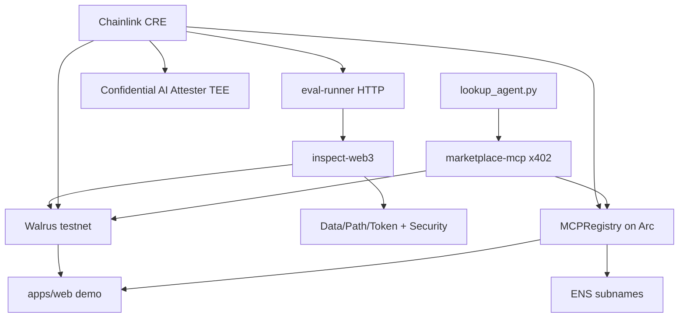

# Architecture

## Packages

| Package | Role |
|---------|------|
| `inspect-web3` | Inspect tasks, scorers, golden benchmarks |
| `walrus-client` | `walrus://` fsspec + HTTP client |
| `eval-runner` | HTTP API for CRE to trigger scoring |
| `marketplace-mcp` | x402 gated MCP lookup |
| `identity` | ENS + Arc registry SDK |
| `apps/web` | Leaderboard, eval viewer, ENS resolver |
| `workflows/eval-pipeline` | Chainlink CRE orchestration |
| `contracts/mcp-registry` | ERC-8004-inspired onchain registry |

## Data flow

1. Inspect eval runs against live MCP → transcript → scorers produce a manifest
2. CRE workflow submits the manifest to the CAI TEE; the completed inference (id + verdict + `response_digest`) is the attestation
3. CRE publishes the manifest + raw eval log to Walrus
4. CRE writes scores to the Arc registry and records the attestation (inference id + `bytes32` transcript hash) via `recordAttestation`
5. ENS text records point to Walrus blobs and registry entries
6. Agent pays x402 on marketplace → receives best MCP endpoint
