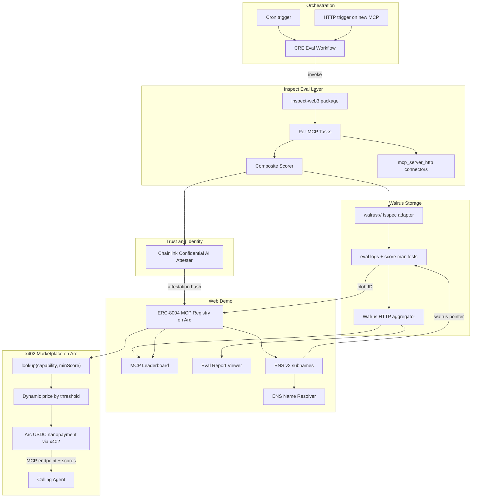

# GoldenMCP Review Bundle

Generated: 2026-06-13T01:24:58Z
Repo: https://github.com/vhspace/goldenmcp

## Plan

```markdown
---
name: GoldenMCP Eval Marketplace
overview: Build goldenmcp from scratch as an AISI Inspect-powered web3 MCP evaluation marketplace targeting three vendor bounties (Arc, Chainlink, ENS) plus main track, with Walrus as the primary eval storage layer powering an interactive web demo — and ready to swap in as a Sui bounty if needed.
todos:
  - id: scaffold
    content: "Scaffold monorepo (uv workspace, Python 3.12), CI, Cursor rules, README, GitHub issues #1-#64"
    status: pending
  - id: inspect-core
    content: "Build packages/inspect-web3: MCP connectors, security + Data/Path/Token scorers, 9 eval tasks"
    status: pending
  - id: walrus-storage
    content: Full walrus:// fsspec adapter + score manifests on Walrus testnet; Inspect reads/writes eval logs via Walrus
    status: pending
  - id: web-demo
    content: "Web demo: leaderboard, Walrus eval reports, ENS resolver — all live data, no simulators"
    status: pending
  - id: identity-layer
    content: ENS v2 subnames + ENSIP-25/26 records with walrus:// pointers; ERC-8004 MCP registry on Arc testnet
    status: pending
  - id: cre-pipeline
    content: Chainlink CRE eval workflow + Confidential AI attestation; reads Walrus manifests, writes scores on Arc
    status: pending
  - id: marketplace-x402
    content: x402 marketplace MCP on Arc testnet (USDC nanopayments via Circle Gateway); lookup(capability, minScore)
    status: pending
  - id: demo-submit
    content: End-to-end demo, architecture diagram, per-bounty submission docs (Arc/Chainlink/ENS), archive plans for judges
    status: pending
isProject: false
---

# GoldenMCP: Web3 MCP Evaluation Marketplace

## Bounty strategy (3 vendor + main track)

ETHGlobal allows **3 vendor bounties + main track**. We commit to:

| Slot | Sponsor | Target prize | Priority |
|------|---------|-------------|----------|
| 1 | **ENS** ($20k) | Best ENS Integration for AI Agents — $2,500 1st | **P0** |
| 2 | **Chainlink** ($14k) | Best workflow with CRE ($2k) + Confidential AI Attester ($2k) | **P0** |
| 3 | **Arc** ($15k) | Best Agentic Economy with Circle Agent Stack — $2,250 1st | **P0** |
| — | **Main track** | Overall product quality, demo, open source | **P0** |
| Reserve | **Sui** ($15k) | Best new build with Walrus — $3k | **Swap-in only** if a primary bounty slot must be dropped |

**Dropped from bounty submissions** (still used as eval subjects): LI.FI, Uniswap, Hedera, Google Cloud, Dynamic, etc.

**Walrus is fully implemented** regardless of bounty slots — it is the primary eval blob store and powers the web demo. Sui submission doc is pre-written so Walrus work doubles as a bounty swap-in if Arc, Chainlink, or ENS cannot be submitted.

### How each primary bounty is satisfied

**ENS — MCP discovery and identity**
- ENS v2 subnames per evaluated MCP (e.g. `lifi-quote.goldenmcp.eth`)
- ENSIP-25 `agent-registration[...]` linking names to ERC-8004 MCP registry on Arc
- ENSIP-26 `agent-endpoint[mcp]` + `agent-context` with capability scores and eval blob pointer
- Functional demo: resolve name → discover MCP endpoint + verified scores (no hard-coded values)
- Present at ENS booth Sunday AM

**Chainlink — eval orchestration and attestation**
- CRE workflow as orchestration layer: trigger eval → read results → attest → write onchain
- Integrates blockchain (Arc registry) with external API (Inspect runner) + LLM (Confidential AI Attester)
- `cre workflow simulate` runs **real workflow code** against real HTTP/EVM capabilities (Chainlink's local DON sandbox — not a fake app layer)
- At least one **real** Confidential AI inference request in sandbox (blocked until key; issue stays open)

**Arc — agentic x402 economy**
- Marketplace MCP settles **USDC nanopayments on Arc testnet** via Circle Gateway / x402
- Agents autonomously pay tiered lookup fees (`lookup("quote", 0.9)` costs more than `0.5`)
- Gas-free micro-settlement demonstrated in demo (not a single large transfer)
- ERC-8004 MCP registry deployed on Arc testnet

**Main track**
- Clear problem: no public, independent validation of web3 MCP quality
- Working end-to-end: eval → attest → register → discover → pay → connect
- Open source repo, architecture diagram, demo video
- **Interactive web demo** browsing Walrus-stored eval reports (not just CLI/API)

### Walrus — primary storage + web demo fuel

Walrus is a **core implementation**, not optional:

- **Primary storage**: eval logs, score manifests, and full Inspect transcripts stored as Walrus blobs on testnet
- **Inspect adapter**: `walrus://` fsspec backend so Inspect natively reads/writes via Walrus paths
- **Identity pointers**: ENS `goldenmcp/eval-blob` and ERC-8004 `agentURI` point to `walrus://<blobId>`
- **Web demo**: public UI fetches manifests from Walrus aggregator HTTP API — leaderboard, per-MCP score breakdowns, eval transcript viewer, attestation status
- **Bounty reserve**: if a primary slot must be dropped, Sui Walrus submission is already satisfied by the same integration

Primary demo narrative: *"GoldenMCP runs standardized Inspect evals, stores verifiable results on Walrus, attests via Chainlink, registers MCPs with ENS names on Arc, and lets agents discover and pay for the best MCP via real x402 nanopayments — all browsable in the web demo."*

---

## Development rules (mandatory)

These rules apply to **all** contributors and agents. Encode in [`.cursor/rules/`](.cursor/rules/) at scaffold time.

### 1. Real code only — no mocking or simulating

- **No mock data**, fake endpoints, stubbed attestation, recorded-response fixtures, or UI simulators
- **No fallbacks** that hide failures — if Walrus, Arc, ENS, Chainlink CAI, or a target MCP is unavailable, **fail loudly** with verbose errors and logging
- All integrations hit **real testnet/mainnet services**: Walrus testnet, Arc testnet, ENS, Chainlink CRE + CAI sandbox, live LI.FI / 0x / Uniswap MCPs
- **x402 `lookup`** is demonstrated via a **real agent or CLI client** paying USDC on Arc — not a web UI simulator
- **Golden datasets** in `benchmarks/golden/` are expected outputs for scoring — not canned MCP responses substituted at runtime
- Local `file://` cache is allowed only as a read-through cache of Walrus blobs already uploaded; never as a substitute data source in demo or production paths

### 2. Test-driven development (TDD)

- **Red → green → refactor** for every issue: write a failing test first, then minimal implementation
- Tests are **integration-first** against real services (or local chain forks where onchain writes are tested); no mock libraries (`unittest.mock`, `msw`, `nock`, CRE capability mocks in production code paths)
- Each GitHub issue lists **acceptance tests** that must pass before close
- CI runs tests on every PR; a failing external dependency blocks the issue until resolved (do not stub around it)

### 3. GitHub issues for scope

- Break all work into **GitHub Issues** on `vhspace/goldenmcp` before implementation starts
- Use **epic labels** + **bite-sized issues** (see [Issue breakdown](#github-issue-breakdown) below)
- One issue = one PR = one concern; no drive-by changes
- Issue template fields: `epic`, `estimate` (hours), `assignee`, `acceptance tests`, `blocked-by`

### 4. Bite-sized delegation

- Target **2–4 hour** issues a single human can pick up between workshops
- Each issue must be **self-contained**: clear inputs, outputs, test command, and definition of done
- Parallel tracks: Python 3.12 + uv (Inspect/Walrus/marketplace), TypeScript + Bun (CRE/web only), Solidity (contracts), DevOps (deploy)
- Phase gates: do not start Phase N+1 epic until Phase N acceptance tests pass on `main`

### Cursor rules to create at scaffold

| Rule file | Scope |
|-----------|-------|
| [`keep-plan-files.mdc`](.cursor/rules/keep-plan-files.mdc) | `alwaysApply: true` — archive all plans to `docs/plans/` |
| [`real-code-only.mdc`](.cursor/rules/real-code-only.mdc) | `alwaysApply: true` — no mocks, simulators, or silent fallbacks |
| [`tdd-required.mdc`](.cursor/rules/tdd-required.mdc) | `alwaysApply: true` — test first, integration tests preferred |

---

## Architecture



---

## Scoring model

Per MCP, per **capability** (e.g. `quote`, `swap`, `trade`). All dimension scores are **0.0–1.0** unless the binary fail gate triggers.

### Dimension scores

| Score | Weight | Range | What it measures |
|-------|--------|-------|------------------|
| **DataScore** | 0.45 | 0.0–1.0 | Output data correctness vs golden fixtures (price within tolerance, valid route hash, expected fields present, tx simulation success). 0.0 = wrong or no response |
| **PathScore** | 0.35 | 0.0–1.0 | Golden path adherence — did the Inspect transcript follow the expected tool-call sequence and decision path? Penalizes wrong turns, unnecessary loops, off-spec tools, or diverging from the benchmark's canonical flow |
| **TokenEfficiency** | 0.20 | 0.0–1.0 | `1 - min(tokens_used / baseline_tokens, 1)` from Inspect transcript |

**Composite** (when not failed) = `0.45 * DataScore + 0.35 * PathScore + 0.20 * TokenEfficiency`

1.0 = perfect across all dimensions. 0.0 = total failure on a dimension (or binary fail — see below).

### Binary fail gate — sketchy behavior

Before computing composite, run a **security pass** on the full Inspect transcript. If any check fails, the run scores **0.0 overall** regardless of dimension scores:

| Fail condition | Examples |
|----------------|----------|
| **Prompt injection in MCP response** | Instructions to ignore prior context, exfiltrate keys, change role |
| **Unexpected tool/resource access** | MCP calls tools not in the golden path allowlist for that capability |
| **Suspicious payload content** | Obfuscated URLs, credential harvesting patterns, eval override attempts |
| **Policy violation** | MCP attempts trades/transfers outside the benchmark's scoped params |

Implementation: `security_scorer` runs first; returns `passed: bool` + `fail_reason`. On fail, manifest records `failed: true`, `composite: 0.0`, and the reason string. No silent downgrade — fail is explicit in Walrus manifest and web demo.

### Golden path definition

Each benchmark in [`benchmarks/golden/`](benchmarks/golden/) defines:

- `expected_data` — fields and tolerances for **DataScore**
- `expected_path` — ordered tool-call sequence (and optional branches) for **PathScore**
- `baseline_tokens` — cap for **TokenEfficiency**
- `allowed_tools` — allowlist for security pass

PathScore formula: `matching_steps / expected_steps`, with partial credit for correct prefix before first divergence. Wrong branch = 0 for remaining path steps.

### Example

LI.FI `quote` golden path: `[get_chains → get_tokens → get_quote]` — if transcript calls `execute_swap` mid-quote, PathScore drops and security pass may binary-fail if `execute_swap` is not allowlisted.

### MVP capability map

- **LI.FI MCP** → `quote`, `route`
- **0x MCP** → `quote`, `trade`
- **Uniswap API MCP** → `quote`, `swap`

Benchmark datasets live in [`benchmarks/datasets/`](benchmarks/datasets/) with golden definitions in [`benchmarks/golden/`](benchmarks/golden/).

---

## x402 marketplace pricing

Marketplace MCP exposes `lookup(capability: str, min_score: float)`:

1. Return `PaymentRequired` with price = `base_usdc * (1 + 4 * min_score)` (e.g. 0.5 → ~3x base, 0.9 → ~4.6x base). Tunable in config.
2. On payment (settled on **Arc testnet**), query score index + ERC-8004 registry on Arc; return ranked MCPs meeting threshold with:
   - ENS name (e.g. `lifi-quote.goldenmcp.eth`)
   - MCP HTTP/SSE endpoint
   - DataScore, PathScore, TokenEfficiency, composite (0.0 if `failed`)
   - Walrus blob ID + link to full eval report in web demo
   - Last Chainlink attestation tx hash on Arc

Use [`@x402/mcp`](https://github.com/coinbase/x402) + Circle Gateway nanopayments on Arc per [Arc agentic economy prize requirements](https://ethglobal.com/events/newyork2026/prizes).

---

## Repo layout (greenfield — no reuse from other vhspace projects)

```
goldenmcp/
├── pyproject.toml                        # uv workspace root; requires-python >=3.12
├── uv.lock
├── .cursor/rules/
│   ├── keep-plan-files.mdc
│   ├── real-code-only.mdc
│   └── tdd-required.mdc
├── docs/
│   ├── plans/
│   ├── architecture.md
│   ├── scoring.md
│   └── submissions/
├── .github/
│   └── ISSUE_TEMPLATE/                   # epic + task templates
├── packages/
│   ├── inspect-web3/                     # Python: tasks, scorers, Walrus-backed logs
│   ├── walrus-client/                    # walrus:// fsspec adapter + HTTP client
│   ├── marketplace-mcp/                  # x402 MCP server; Arc testnet settlement
│   └── identity/                         # ENS CLI wrappers + registry SDK
├── apps/
│   └── web/                              # Public demo: leaderboard, Walrus reports, ENS lookup
├── workflows/eval-pipeline/              # Chainlink CRE (TypeScript + cre-sdk)
├── contracts/mcp-registry/               # ERC-8004-derived MCP registry (deploy on Arc)
├── benchmarks/{datasets,golden}/
├── skills/ens-mcp-identity/              # ENS CLI skill for hackathon ops
└── demo/                                 # One-command judge demo script
```

**Tech choices:**

### Python (default stack) — 3.12 + uv

Use **Python 3.12** and **[uv](https://docs.astral.sh/uv/)** for all Python work. No `pip`, `pip install`, or `python -m venv`.

| Task | Command pattern |
|------|-----------------|
| Install deps | `uv sync` (per-package `pyproject.toml` + `uv.lock`) |
| Run tests | `uv run pytest` |
| Run Inspect evals | `uv run inspect eval ...` or `uvx inspect-ai eval ...` for one-off |
| Run services | `uv run python -m goldenmcp.eval_runner` |
| One-off CLIs | `uvx <tool>` (e.g. `uvx inspect-ai`, `uvx ruff`) |

Python packages: `inspect-web3`, `walrus-client`, `marketplace-mcp`, eval-runner HTTP service.

Pin `requires-python = ">=3.12,<3.13"` in each `pyproject.toml`. Root workspace uses `uv` workspace members if monorepo.

### TypeScript (only where required)

| Component | Why TS |
|-----------|--------|
| `workflows/eval-pipeline/` | Chainlink CRE SDK (`@chainlink/cre-sdk`) — WASM workflow, Bun runtime |
| `apps/web/` | Next.js web demo |

Use **Bun** for CRE and frontend (`bun install`, `bun test`, `cre workflow simulate`). No TypeScript for Python-owned services unless a dependency forces it.

### Other

- **Solidity** — ERC-8004 MCP registry on Arc testnet
- **Arc testnet + Circle Gateway** — x402 USDC nanopayments
- **ENS** — [ens-cli](https://github.com/gskril/ens-cli) + ENSIP-25/26
- **Walrus testnet** — CLI + HTTP aggregator ([docs.wal.app](https://docs.wal.app/))

---

## Component details

### Cursor rules and plan archive

See [Development rules](#development-rules-mandatory). README links to `docs/plans/` for judge review.

### Inspect extension — `packages/inspect-web3/`

Consume Inspect as a **dependency only** (no upstream contributions). Package provides:

- **MCP connectors**: `mcp_server_http()` per target MCP (LI.FI, 0x, Uniswap)
- **Tasks**: one Inspect `Task` per (mcp, capability) pair
- **Scorers** (run in order):
  1. `security_scorer` — binary fail gate for sketchy/injection behavior
  2. `data_scorer` — DataScore (0.45 weight)
  3. `path_scorer` — PathScore (0.35 weight)
  4. `token_efficiency_scorer` — TokenEfficiency (0.20 weight)
  5. `composite_scorer` — weighted sum; forces 0.0 if security fail
- **Hooks**: post-eval hook writes score manifest JSON (includes `failed`, `fail_reason`, per-dimension scores)

Register as Inspect component via `pyproject.toml` entry points. Run evals with:

```bash
uv run inspect eval goldenmcp/quote --model openai/gpt-4o
```

### Walrus storage — `packages/walrus-client/` (P0)

Inspect uses `fsspec` for `resource()`, `csv_dataset()`, `list_eval_logs()`, `write_eval_log()` ([Inspect filesystem docs](https://inspect.aisi.org.uk/extensions.html)).

Implement full `WalrusFileSystem` + setuptools entry point:

```toml
[project.entry-points."fsspec.specs"]
walrus = "goldenmcp_walrus:WalrusFileSystem"
```

**What gets stored on Walrus:**
- Inspect `.eval` logs per (mcp, capability, run)
- Score manifest JSON (DataScore, PathScore, TokenEfficiency, composite, `failed`, `fail_reason`)
- Golden dataset snapshots (versioned, content-addressed)

**Paths:** `walrus://evals/{mcp}/{capability}/{run-id}.eval`

Upload via Walrus publisher HTTP API; read via aggregator. Local `file://` cache optional for dev speed only — Walrus is source of truth for demo and identity pointers.

ENS/ERC-8004 records use `goldenmcp/eval-blob = walrus://<blobId>` and `agentURI` → Walrus-hosted registration JSON.

Upload via Walrus publisher HTTP API; read via aggregator. Walrus testnet is the only source of truth for demo and identity pointers.

### Web demo — `apps/web/` (P0)

Public-facing demo — **live data only**:

| Page / feature | Data source |
|----------------|-------------|
| **Leaderboard** | Arc registry + Walrus score manifests via aggregator |
| **MCP detail** | Per-capability scores from real eval runs |
| **Eval report viewer** | Full Inspect transcript from Walrus blob |
| **ENS resolver** | Live ENS resolution → endpoint + scores + Walrus link |

x402 `lookup` is **not** in the web app. Demo uses a real agent/CLI client (see [Demo script](#demo-script-for-judges)).

### ERC-8004 repurposed for MCP identity — `contracts/mcp-registry/` (Arc testnet)

Fork ERC-8004 Identity Registry semantics but registration file schema targets **MCP servers** not agents:

- `type`: `goldenmcp/mcp-registration/v1`
- `services[]`: `{ name: "mcp", endpoint: "https://...", version: "..." }`
- `capabilities[]`: `{ name: "quote", dataScore, pathScore, tokenEfficiency, compositeScore, failed, walrusBlobId }`
- `attestations[]`: Chainlink CAI attestation refs

Deploy on **Arc testnet** to satisfy Arc bounty onchain requirements. Validation Registry for attestation verification.

### ENS v2 integration — `packages/identity/` + `skills/ens-mcp-identity/`

Per evaluated MCP:

1. Register subname: `{vendor}-{capability}.goldenmcp.eth` (or parent you control)
2. Set ENSIP-25: `agent-registration[<erc7930-registry>][<mcpId>] = "1"`
3. Set ENSIP-26: `agent-endpoint[mcp] = <url>`, `agent-context` = JSON summary with scores + Walrus pointer
4. Custom text record: `goldenmcp/eval-blob = walrus://<blobId>`

Use ens-cli + project skill for repeatable registration during eval pipeline. **ENS booth presentation Sunday AM** is a hard deadline.

### Chainlink CRE eval pipeline — `workflows/eval-pipeline/`

CRE workflow (TypeScript) with:

- **Trigger**: Cron (nightly re-eval) + HTTP (on-demand MCP registration)
- **Steps**:
  1. Fetch MCP list from Arc registry contract
  2. HTTP capability call to kick Inspect runner (external service; CRE cannot run Python)
  3. Read score manifest from Walrus via aggregator HTTP (blob ID from eval-runner)
  4. Submit summary to **Chainlink Confidential AI Attester** (sandbox when key provided)
  5. EVM write on **Arc**: update registry scores + attestation hash

**MVP**: `cre workflow simulate` with real eval-runner HTTP + real Walrus read + real CAI call. Live DON deploy if time permits.

### x402 Marketplace MCP — `packages/marketplace-mcp/` (Arc settlement)

Standalone MCP server (HTTP transport) with tools:

| Tool | Description |
|------|-------------|
| `lookup` | Find best MCP for capability at min_score (x402 gated, Arc USDC) |
| `list_capabilities` | Free tier: available capabilities |
| `get_scores` | Paid: full score breakdown for one MCP |
| `register_mcp` | Vendor tool: submit MCP for eval queue |

Index built from Walrus score manifests + onchain Arc registry. Arc bounty demo: **autonomous agent** pays real USDC micropayment via x402, receives real MCP endpoint.

---

## GitHub issue breakdown

Create these issues at Phase 0 before coding. Labels: `epic/*`, `P0`, `estimate:2h|4h`.

### Epic: `epic/infra` — Scaffold and rules (Phase 0)

| Issue | Estimate | Assignee skill | Done when |
|-------|----------|----------------|-----------|
| #1 Monorepo + CI skeleton | 2h | DevOps | `uv run pytest` + `bun test` in CI; Python 3.12 pinned |
| #2 Cursor rules (plans, real-code, TDD) | 1h | Lead | Three `.mdc` files committed |
| #3 GitHub issue templates + labels | 1h | Lead | Epics creatable from template |
| #4 Dev env doc + `.env.example` | 2h | Any | README: `uv sync`, Arc/ENS/CRE/Walrus setup (no pip) |

### Epic: `epic/eval` — Inspect core (Phase 1)

| Issue | Estimate | Assignee skill | Done when |
|-------|----------|----------------|-----------|
| #10 Security scorer + composite tests (TDD) | 2h | Python | Injection/path-violation cases binary-fail |
| #10b DataScore + PathScore + TokenEfficiency scorers (TDD) | 3h | Python | Failing tests → all three scorers pass |
| #11 LI.FI MCP connector + `quote` task | 4h | Python | Live LI.FI quote eval passes |
| #12 0x MCP `quote` + `trade` tasks | 4h | Python | Live 0x evals pass |
| #13 Uniswap MCP `quote` + `swap` tasks | 4h | Python | Live Uniswap evals pass |
| #14 Golden datasets with expected_path + security allowlists | 3h | Python | All 9 task runs produce manifests with 3 dimension scores |

### Epic: `epic/walrus` — Storage (Phase 2)

| Issue | Estimate | Assignee skill | Done when |
|-------|----------|----------------|-----------|
| #20 Walrus client upload test (TDD) | 2h | Python | Real blob on testnet |
| #21 `walrus://` fsspec adapter | 4h | Python | Inspect writes `.eval` to Walrus |
| #22 Score manifest schema + upload | 2h | Python | Manifest retrievable via aggregator |
| #23 Post-eval hook → Walrus pipeline | 2h | Python | Full eval run end-to-end on Walrus |

### Epic: `epic/web` — Web demo (Phase 3)

| Issue | Estimate | Assignee skill | Done when |
|-------|----------|----------------|-----------|
| #30 Leaderboard page (live Arc + Walrus) | 4h | Frontend | Deployed URL shows real scores |
| #31 Eval report viewer (Walrus blob) | 3h | Frontend | Click MCP → transcript + Data/Path/Token scores; show fail_reason if binary-failed |
| #32 ENS resolver page | 3h | Frontend | Live ENS lookup, no hard-coded names |
| #33 Deploy `apps/web` to public URL | 2h | DevOps | URL in README |

### Epic: `epic/identity` — ENS + Arc registry (Phase 4)

| Issue | Estimate | Assignee skill | Done when |
|-------|----------|----------------|-----------|
| #40 MCP registry contract + tests (TDD) | 4h | Solidity | Deployed Arc testnet |
| #41 Register 3 MCPs with Walrus pointers | 2h | Full-stack | Onchain entries verified |
| #42 ENS subnames + ENSIP-25/26 records | 3h | ENS | Live resolution in web demo |
| #43 ENS CLI skill for repeatable registration | 2h | Lead | Skill doc + script |

### Epic: `epic/chainlink` — CRE pipeline (Phase 5)

| Issue | Estimate | Assignee skill | Done when |
|-------|----------|----------------|-----------|
| #50 Eval-runner HTTP service | 3h | Python | CRE can trigger real Inspect run |
| #51 CRE workflow: trigger → Walrus read | 4h | TypeScript | `cre workflow simulate` passes |
| #52 CAI attestation integration | 4h | TypeScript | Real sandbox inference recorded |
| #53 CRE → Arc onchain score write | 3h | TypeScript | Registry updated after workflow |
| #54 Attestation badge in web demo | 2h | Frontend | Shows real tx hash |

### Epic: `epic/marketplace` — x402 on Arc (Phase 6)

| Issue | Estimate | Assignee skill | Done when |
|-------|----------|----------------|-----------|
| #60 Marketplace MCP server skeleton | 3h | Python | HTTP MCP transport via `uv run`; Arc settlement |
| #61 `lookup` tool + tiered pricing | 3h | Python | Real 402 response with Arc USDC price |
| #62 x402 payment + settlement on Arc | 4h | Full-stack | Real micropayment completes |
| #63 Agent demo script (`demo/lookup-agent`) | 3h | Any | Script pays and receives MCP config |
| #64 Submission docs + demo video | 4h | Lead | ENS/Chainlink/Arc docs + 3-min video |

**Delegation tip:** Issues #11–#13, #30–#32, #40–#42, #50–#53, #60–#62 can run in parallel once #1 and #20 are done.

---

## Implementation phases (hackathon weekend)

Priority order: **Walrus + eval core** early (feeds web demo), then **ENS + Chainlink + Arc**.

### Phase 0 — Scaffold (Friday PM)
- Monorepo with **uv workspace**, Python 3.12, `uv.lock`; Bun for TS packages only
- CI: `uv run pytest`, `bun test`; no pip in any script or Dockerfile
- **Create all issues #1–#64** before writing feature code
- Submission templates: `docs/submissions/{ens,chainlink,arc,sui-walrus-reserve}.md`
- Copy this plan to `docs/plans/`

### Phase 1 — Eval core (Friday night → Saturday AM)
- `inspect-web3` package with one working task: LI.FI `quote`
- Golden datasets with `expected_data`, `expected_path`, `allowed_tools`
- `security_scorer` + dimension scorers (TDD, issue #10/#10b)
- Manual eval run produces `.eval` log

### Phase 2 — Walrus storage (Saturday AM) — **P0**
- Full `walrus://` fsspec adapter; upload eval logs + score manifests to Walrus testnet
- Score manifest schema v1 with `walrusBlobId` field
- Full composite scorer; run all 3 MCPs × 3 capabilities (9 tasks) → Walrus

### Phase 3 — Web demo v1 (Saturday midday) — **P0**
- `apps/web/` leaderboard + MCP detail pages reading Walrus manifests
- Eval report viewer (fetch blob via aggregator)
- Deploy public URL for judges

### Phase 4 — ENS + Arc identity (Saturday PM) — **P0**
- Deploy MCP registry contract on **Arc testnet**
- Register 3 MCPs onchain with Walrus blob pointers
- ENS subnames + ENSIP-25/26 text records; wire ENS resolver into web demo

### Phase 5 — Chainlink CRE (Saturday PM → Sunday AM) — **P0**
- CRE workflow: trigger eval → read Walrus manifest → CAI attest → Arc onchain update
- Attestation status surfaced in web demo

### Phase 6 — Arc x402 marketplace + final demo (Sunday AM) — **P0**
- Issues #60–#63: real x402 marketplace MCP + agent demo script
- 3-min video: web demo (Walrus/ENS) + agent pays on Arc (no UI simulator)
- Per-bounty submission docs; ENS booth prep

---

## Key dependencies (install fresh — no copy from other repos)

| Package | Purpose |
|---------|---------|
| `inspect_ai` | Eval framework (`uv add inspect-ai`) |
| `uv` / `uvx` | Python deps and CLI execution (no pip) |
| `fsspec` | Filesystem abstraction |
| `@chainlink/cre-sdk` | CRE workflow |
| `@x402/mcp` or `x402` | Marketplace payments on Arc |
| `viem` / `ethers` | Arc registry + ENS writes |
| `ens-cli` | Name management |
| Walrus CLI + HTTP aggregator | Primary eval blob storage |
| Next.js (or similar) | Web demo app |

---

## Risks and mitigations

| Risk | Mitigation |
|------|------------|
| Chainlink CAI key not ready | Issue #52 stays open/blocked; do not stub — demo proceeds for other bounties until key arrives |
| MCP server down at hackathon | Issue blocked; verbose error in eval log; fix or wait — no recorded fixtures |
| CRE cannot run Python Inspect | Eval-runner HTTP service (#50) is real Inspect — CRE calls it over HTTP |
| Arc x402 / Gateway setup friction | Issue #62 focused; use Circle hackathon docs; escalate early |
| Walrus testnet instability | Retry with logging; issue blocked until testnet responds — no local substitute in demo |
| Team parallelism | GitHub issues #11–#13, #30–#32 parallelizable per [Issue breakdown](#github-issue-breakdown) |
| ENS booth deadline Sunday AM | Issue #42 P0; demo ENS resolution before Sunday |

---

## Demo script for judges

**Web demo (browser):**
1. Leaderboard — real LI.FI vs 0x vs Uniswap scores from Walrus manifests
2. Click MCP → full Inspect eval report from Walrus blob
3. ENS resolver — live lookup of `lifi-quote.goldenmcp.eth`

**Agent demo (terminal/video):**
4. `inspect eval` live → new Walrus blob
5. CRE workflow run → real attestation + Arc registry update (tx hash shown in web demo)
6. `demo/lookup-agent` — real `lookup("quote", 0.9)` → HTTP 402 → USDC payment on Arc → live MCP endpoint returned
7. Agent connects to returned MCP and executes one quote

No simulators anywhere in the demo path.

---

## Out of scope (explicit)

- Mocking, simulating, stubbing, or silent fallbacks in application code
- `pip` / `pip install` — use `uv` / `uvx` only for Python
- UI lookup simulator (x402 demo is agent/CLI only)
- Contributing code upstream to Inspect
- Reusing code from other vhspace projects
- Submitting for LI.FI, Uniswap, Hedera, Google Cloud, or other vendor bounties (Sui reserve doc kept, not submitted unless slot swap)
- Full production marketplace beyond hackathon MVP
```

## GitHub issues (open)

### GH #32: [#64] Submission docs + demo video

Labels: epic/marketplace, P0, estimate:4h

## Epic
`epic/marketplace`

## Estimate
`estimate:4h`

## Assignee skill
Lead

## Acceptance tests
ENS/Chainlink/Arc docs in docs/submissions/ + demo script

## Plan reference
GoldenMCP eval marketplace — issue #64

### GH #31: [#63] Agent demo script (demo/lookup_agent.py)

Labels: epic/marketplace, P0, estimate:3h

## Epic
`epic/marketplace`

## Estimate
`estimate:3h`

## Assignee skill
Any

## Acceptance tests
Script pays and receives MCP config

## Plan reference
GoldenMCP eval marketplace — issue #63

### GH #30: [#62] x402 payment + settlement on Arc

Labels: epic/marketplace, P0, estimate:4h

## Epic
`epic/marketplace`

## Estimate
`estimate:4h`

## Assignee skill
Full-stack

## Acceptance tests
Real micropayment completes on Arc testnet

## Plan reference
GoldenMCP eval marketplace — issue #62

### GH #29: [#61] lookup tool + tiered pricing

Labels: epic/marketplace, P0, estimate:3h

## Epic
`epic/marketplace`

## Estimate
`estimate:3h`

## Assignee skill
Python

## Acceptance tests
Real HTTP 402 response with Arc USDC price

## Plan reference
GoldenMCP eval marketplace — issue #61

### GH #28: [#60] Marketplace MCP server skeleton

Labels: epic/marketplace, P0, estimate:3h

## Epic
`epic/marketplace`

## Estimate
`estimate:3h`

## Assignee skill
Python

## Acceptance tests
HTTP MCP transport via `uv run python -m goldenmcp_marketplace`

## Plan reference
GoldenMCP eval marketplace — issue #60

### GH #27: [#54] Attestation badge in web demo

Labels: epic/chainlink, P0, estimate:2h

## Epic
`epic/chainlink`

## Estimate
`estimate:2h`

## Assignee skill
Frontend

## Acceptance tests
Web demo shows real attestation tx hash

## Plan reference
GoldenMCP eval marketplace — issue #54

### GH #26: [#53] CRE → Arc onchain score write

Labels: epic/chainlink, P0, estimate:3h

## Epic
`epic/chainlink`

## Estimate
`estimate:3h`

## Assignee skill
TypeScript

## Acceptance tests
Registry updated after workflow run

## Plan reference
GoldenMCP eval marketplace — issue #53

### GH #25: [#52] CAI attestation integration

Labels: epic/chainlink, P0, estimate:4h

## Epic
`epic/chainlink`

## Estimate
`estimate:4h`

## Assignee skill
TypeScript

## Acceptance tests
Real Confidential AI sandbox inference recorded

## Plan reference
GoldenMCP eval marketplace — issue #52

### GH #24: [#51] CRE workflow: trigger → Walrus read

Labels: epic/chainlink, P0, estimate:4h

## Epic
`epic/chainlink`

## Estimate
`estimate:4h`

## Assignee skill
TypeScript

## Acceptance tests
`cre workflow simulate` passes

## Plan reference
GoldenMCP eval marketplace — issue #51

### GH #23: [#50] Eval-runner HTTP service

Labels: epic/chainlink, P0, estimate:3h

## Epic
`epic/chainlink`

## Estimate
`estimate:3h`

## Assignee skill
Python

## Acceptance tests
CRE can trigger real Inspect run via POST /eval

## Plan reference
GoldenMCP eval marketplace — issue #50

### GH #22: [#43] ENS CLI skill for repeatable registration

Labels: epic/identity, P0, estimate:2h

## Epic
`epic/identity`

## Estimate
`estimate:2h`

## Assignee skill
Lead

## Acceptance tests
`skills/ens-mcp-identity/SKILL.md` + registration script

## Plan reference
GoldenMCP eval marketplace — issue #43

### GH #21: [#42] ENS subnames + ENSIP-25/26 records

Labels: epic/identity, P0, estimate:3h

## Epic
`epic/identity`

## Estimate
`estimate:3h`

## Assignee skill
ENS

## Acceptance tests
Live resolution in web demo

## Plan reference
GoldenMCP eval marketplace — issue #42

### GH #20: [#41] Register 3 MCPs with Walrus pointers

Labels: epic/identity, P0, estimate:2h

## Epic
`epic/identity`

## Estimate
`estimate:2h`

## Assignee skill
Full-stack

## Acceptance tests
Onchain entries verified for lifi, 0x, uniswap

## Plan reference
GoldenMCP eval marketplace — issue #41

### GH #19: [#40] MCP registry contract + tests (TDD)

Labels: epic/identity, P0, estimate:4h

## Epic
`epic/identity`

## Estimate
`estimate:4h`

## Assignee skill
Solidity

## Acceptance tests
`forge test -C contracts/mcp-registry` passes; deployed Arc testnet

## Plan reference
GoldenMCP eval marketplace — issue #40

### GH #18: [#33] Deploy apps/web to public URL

Labels: epic/web, P0, estimate:2h

## Epic
`epic/web`

## Estimate
`estimate:2h`

## Assignee skill
DevOps

## Acceptance tests
Public URL documented in README

## Plan reference
GoldenMCP eval marketplace — issue #33

### GH #17: [#32] ENS resolver page

Labels: epic/web, P0, estimate:3h

## Epic
`epic/web`

## Estimate
`estimate:3h`

## Assignee skill
Frontend

## Acceptance tests
Live ENS lookup at /ens, no hard-coded names

## Plan reference
GoldenMCP eval marketplace — issue #32

### GH #16: [#31] Eval report viewer (Walrus blob)

Labels: epic/web, P0, estimate:3h

## Epic
`epic/web`

## Estimate
`estimate:3h`

## Assignee skill
Frontend

## Acceptance tests
Click MCP → transcript + Data/Path/Token scores; show fail_reason if binary-failed

## Plan reference
GoldenMCP eval marketplace — issue #31

### GH #15: [#30] Leaderboard page (live Arc + Walrus)

Labels: epic/web, P0, estimate:4h

## Epic
`epic/web`

## Estimate
`estimate:4h`

## Assignee skill
Frontend

## Acceptance tests
Deployed URL shows real scores from Arc registry

## Plan reference
GoldenMCP eval marketplace — issue #30

### GH #14: [#23] Post-eval hook → Walrus pipeline

Labels: epic/walrus, P0, estimate:2h

## Epic
`epic/walrus`

## Estimate
`estimate:2h`

## Assignee skill
Python

## Acceptance tests
Full eval run end-to-end on Walrus testnet

## Plan reference
GoldenMCP eval marketplace — issue #23

### GH #13: [#22] Score manifest schema + upload

Labels: epic/walrus, P0, estimate:2h

## Epic
`epic/walrus`

## Estimate
`estimate:2h`

## Assignee skill
Python

## Acceptance tests
Manifest retrievable via Walrus aggregator HTTP API

## Plan reference
GoldenMCP eval marketplace — issue #22

### GH #12: [#21] walrus:// fsspec adapter

Labels: epic/walrus, P0, estimate:4h

## Epic
`epic/walrus`

## Estimate
`estimate:4h`

## Assignee skill
Python

## Acceptance tests
Inspect writes .eval to Walrus via walrus:// paths

## Plan reference
GoldenMCP eval marketplace — issue #21

### GH #11: [#20] Walrus client upload test (TDD)

Labels: epic/walrus, P0, estimate:2h

## Epic
`epic/walrus`

## Estimate
`estimate:2h`

## Assignee skill
Python

## Acceptance tests
Real blob on Walrus testnet; `uv run pytest packages/walrus-client/tests/`

## Plan reference
GoldenMCP eval marketplace — issue #20

### GH #10: [#14] Golden datasets with expected_path + security allowlists

Labels: epic/eval, P0, estimate:3h

## Epic
`epic/eval`

## Estimate
`estimate:3h`

## Assignee skill
Python

## Acceptance tests
All 9 task runs produce manifests with 3 dimension scores

## Plan reference
GoldenMCP eval marketplace — issue #14

### GH #9: [#13] Uniswap MCP quote + swap tasks

Labels: epic/eval, P0, estimate:4h

## Epic
`epic/eval`

## Estimate
`estimate:4h`

## Assignee skill
Python

## Acceptance tests
Live Uniswap evals pass with UNISWAP_MCP_URL set

## Plan reference
GoldenMCP eval marketplace — issue #13

### GH #8: [#12] 0x MCP quote + trade tasks

Labels: epic/eval, P0, estimate:4h

## Epic
`epic/eval`

## Estimate
`estimate:4h`

## Assignee skill
Python

## Acceptance tests
Live 0x evals pass with ZEROX_MCP_URL set

## Plan reference
GoldenMCP eval marketplace — issue #12

### GH #7: [#11] LI.FI MCP connector + quote task

Labels: epic/eval, P0, estimate:4h

## Epic
`epic/eval`

## Estimate
`estimate:4h`

## Assignee skill
Python

## Acceptance tests
Live LI.FI quote eval passes with LIFI_MCP_URL set

## Plan reference
GoldenMCP eval marketplace — issue #11

### GH #6: [#10b] DataScore + PathScore + TokenEfficiency scorers (TDD)

Labels: epic/eval, P0, estimate:3h

## Epic
`epic/eval`

## Estimate
`estimate:3h`

## Assignee skill
Python

## Acceptance tests
All dimension scorers pass; composite weights 0.45/0.35/0.20

## Plan reference
GoldenMCP eval marketplace — issue #10b

### GH #5: [#10] Security scorer + composite tests (TDD)

Labels: epic/eval, P0, estimate:2h

## Epic
`epic/eval`

## Estimate
`estimate:2h`

## Assignee skill
Python

## Acceptance tests
Injection/path-violation cases binary-fail; `uv run pytest packages/inspect-web3/tests/test_scorers.py`

## Plan reference
GoldenMCP eval marketplace — issue #10

### GH #4: [#4] Dev env doc + .env.example

Labels: epic/infra, P0, estimate:2h

## Epic
`epic/infra`

## Estimate
`estimate:2h`

## Assignee skill
Any

## Acceptance tests
README documents `uv sync`, Arc/ENS/CRE/Walrus setup (no pip)

## Plan reference
GoldenMCP eval marketplace — issue #4

### GH #3: [#3] GitHub issue templates + labels

Labels: epic/infra, P0, estimate:1h

## Epic
`epic/infra`

## Estimate
`estimate:1h`

## Assignee skill
Lead

## Acceptance tests
Epics creatable from template; labels epic/* and estimate:* exist

## Plan reference
GoldenMCP eval marketplace — issue #3

### GH #2: [#2] Cursor rules (plans, real-code, TDD)

Labels: epic/infra, P0, estimate:1h

## Epic
`epic/infra`

## Estimate
`estimate:1h`

## Assignee skill
Lead

## Acceptance tests
Three `.mdc` files committed in `.cursor/rules/`

## Plan reference
GoldenMCP eval marketplace — issue #2

### GH #1: [#1] Monorepo + CI skeleton

Labels: epic/infra, P0, estimate:2h

## Epic
`epic/infra`

## Estimate
`estimate:2h`

## Assignee skill
DevOps

## Acceptance tests
`uv run pytest` + `bun test` in CI; Python 3.12 pinned

## Plan reference
GoldenMCP eval marketplace — issue #1

