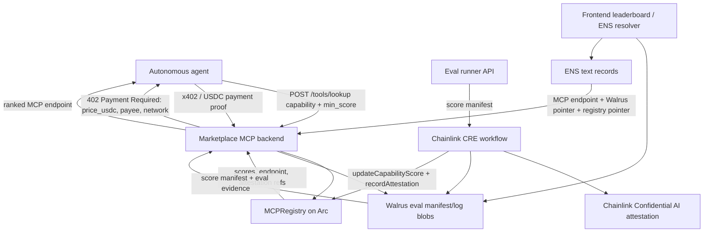

# Arc Agentic Economy bounty submission

## Bounty we are submitting for

GoldenMCP is submitted for the **Arc Agentic Economy** bounty track as an agent-facing MCP discovery marketplace. The core user story is:

> An autonomous agent pays an x402 USDC micropayment on Arc, asks for the best Web3 MCP for a capability, and receives a ranked MCP endpoint backed by evaluation scores, attestations, and decentralized storage pointers.

## Circle tooling used

GoldenMCP explicitly uses or is designed around the following Circle/agentic-payment tooling:

- **Circle Gateway / USDC rail:** the lookup marketplace prices requests in USDC and is structured for Arc settlement where USDC is the native payment/gas asset.
- **x402:** `packages/marketplace-mcp` returns an HTTP `402 Payment Required` challenge before serving paid lookup results; `demo/lookup_agent.py` models the autonomous retry after payment.
- **Agent Stack:** the product is built for autonomous agents consuming MCP endpoints, with a demo agent that requests capability-specific MCP recommendations.

## Working frontend checklist

| Requirement | Status | Evidence |
| --- | --- | --- |
| Public leaderboard / eval viewer | Implemented | `apps/web/src/app/page.tsx`, `apps/web/src/app/leaderboard/page.tsx`, `apps/web/src/app/mcp/[mcp]/[capability]/page.tsx` |
| ENS resolver UI | Implemented | `apps/web/src/app/ens/page.tsx`, `apps/web/src/app/api/ens/route.ts` |
| Reads scored MCP data | Implemented for local/Walrus-shaped data | `apps/web/src/lib/data.ts` |
| Local run command | Documented | `cd apps/web && bun install && bun run dev` |

## Working backend checklist

| Requirement | Status | Evidence |
| --- | --- | --- |
| x402-gated marketplace MCP | Implemented | `packages/marketplace-mcp/src/goldenmcp_marketplace/app.py` |
| Eval runner API | Implemented | `packages/eval-runner/src/goldenmcp_eval_runner/app.py` |
| Arc registry contract | Implemented | `contracts/mcp-registry/src/MCPRegistry.sol` |
| CRE to Arc write path | Implemented | `workflows/eval-pipeline/src/pipeline.ts` (`writeToArc`) |
| Local demo wrapper | Implemented | `demo/run_demo.sh`, `demo/README.md` |

## Architecture diagram



## Demo

```bash
# smoke tests and local demo pointers
./demo/run_demo.sh

# start backend services in separate shells when credentials are available
uv run python -m goldenmcp_eval_runner
uv run python -m goldenmcp_marketplace

# run the lookup agent against the marketplace
uv run python demo/lookup_agent.py --capability quote --min-score 0.9
```

See [`../../demo/README.md`](../../demo/README.md) for the complete judge runbook, prerequisites, expected outputs, and live-credential notes.

## 3-minute demo video outline

A final recorded submission video should follow this timeline:

1. **0:00–0:25 — Problem and product:** agents need a reliable way to find high-quality Web3 MCP servers without manually testing every endpoint.
2. **0:25–0:55 — Evaluation pipeline:** show the README, Inspect evals, eval-runner API, Chainlink CRE pipeline, Confidential AI attestation, and Walrus publication.
3. **0:55–1:25 — Registry and identity:** show `MCPRegistry.sol`, ENS text records, and the frontend ENS resolver.
4. **1:25–2:05 — x402 paid lookup:** show the marketplace MCP returning a 402 challenge, then the lookup agent retrying after payment and receiving ranked MCP endpoints.
5. **2:05–2:35 — Frontend:** show the leaderboard/eval viewer and explain how score evidence maps back to Walrus and attestation references.
6. **2:35–3:00 — Bounty fit:** explicitly state that GoldenMCP is submitted for Arc Agentic Economy and name Circle Gateway/USDC, x402, and Agent Stack.

## Code references

- `packages/marketplace-mcp/src/goldenmcp_marketplace/app.py`
- `demo/lookup_agent.py`
- `contracts/mcp-registry/src/MCPRegistry.sol`
- `workflows/eval-pipeline/src/pipeline.ts`
- `apps/web/src/app/leaderboard/page.tsx`
- `apps/web/src/app/ens/page.tsx`
